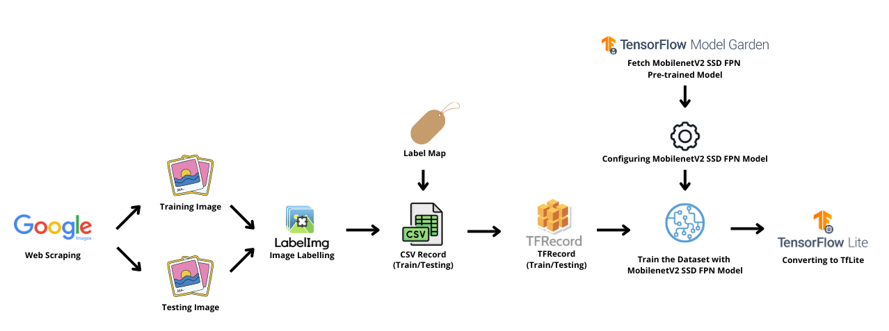

 <h1 align="center"> ML-Model </h1>

This Repository is used by Machine Learning path cohort to develop object detection models to implement the Organic Vegetable Storage Suggestions Classification

 
<h3>Deployment Environment</h3>
 

1. Dependency
   
  <pre>
  - express
  - jsonwebtoken
  - bcrypt
  - dotenv
  - mysql </pre>
   
2. Environment variable
   
  <pre>
  - GOOGLE_PROJECT_ID={your project ID}
  - CLOUD_RUN_SERVICE={your cloud run service name}
  - REPO_NAME={your artifact registry repository name}
  - INSTANCE_CONNECTION_NAME={your project ID:location:sql instance name}
  - DB_USER={instance admin usename}
  - DB_PASS={instance admin password}
  - DB_NAME={database user name}
  - DB_NAME_ML={database ML name}
  - ACCESS_TOKEN_SECRET={your own access token key}
  - REFRESH_TOKEN_SECRET={yout own refresh token key} </pre>
   
3. Cloud shell command
   
  <pre>
  - gcloud builds submit --tag {location}-docker.pkg.dev/$GOOGLE_PROJECT_ID/$REPO_NAME/$CLOUD_RUN_SERVICE \
    --project=$GOOGLE_PROJECT_ID
     
  - gcloud run deploy $CLOUD_RUN_SERVICE \
    --image {location}-docker.pkg.dev/$GOOGLE_PROJECT_ID/$REPO_NAME/$CLOUD_RUN_SERVICE \
    --add-cloudsql-instances $INSTANCE_CONNECTION_NAME \
    --update-env-vars INSTANCE_CONNECTION_NAME=$INSTANCE_CONNECTION_NAME,DB_USER=$DB_USER,DB_PASS=$DB_PASS,DB_NAME=$DB_NAME,ACCESS_TOKEN_SECRET=$ACCESS_TOKEN_SECRET,REFRESH_TOKEN_SECRET=$REFRESH_TOKEN_SECRET,DB_NAME_ML=$DB_NAME_ML \
    --platform managed \
    --region {location} \
    --allow-unauthenticated \
    --project=$GOOGLE_PROJECT_ID </pre>
     

