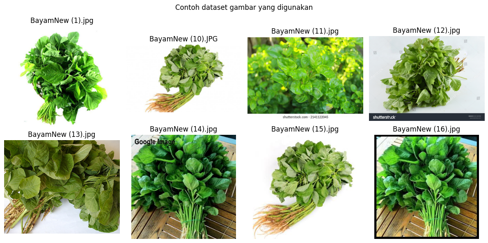
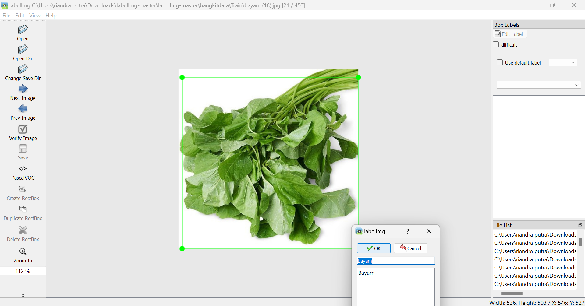
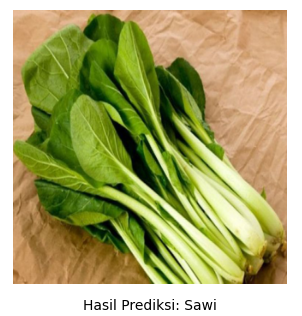
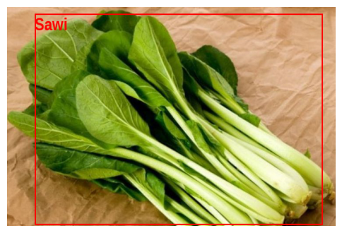

  

<h1 align="center"> ML-Model </h1>

This Repository is used by Machine Learning path cohort to develop object detection models to implement the Organic Vegetable Storage Suggestions Classification

 
<h3>Machine Learning Project Timeline</h3>
 

1. Google Image Scraping
    
   
   <pre>
   - Training Images: These images are used for training the model.
   - Testing Images: These images are used for evaluating the trained model's performance.</pre>
    
2. Labelling Images Using LabelImg
    
   
   <pre>
   - This involves marking regions of interest in the images and assigning appropriate class labels.</pre>
    
3. Label Map Creation
    
   <pre>
   - A mapping between the class labels and their integer identifiers is created.</pre>
    
4. CSV Record Creation (Train/Testing)
    
   <pre>
   - A CSV record is created for both the training and testing datasets. This record contains image file paths, object bounding box coordinates, and class labels.</pre>
    
5. TFRecord Creation (Train and Testing)
    
   <pre>
   - The CSV files for both training and testing data are converted into the TFRecord format.</pre>
    
6. Fetch MobileNetV2 SSD FPN Pretrained Model
    
   <pre>
   - We fetch the pre-trained MobileNetV2 SSD FPN model to accelerate our training process.</pre>
    
7. Configuring MobileNetV2 SSD FPN Model
    
   <pre>
   - The fetched model is configured according to our project's specific needs, such as:
   - num_steps = 15000
   - batch_size = 16
   - num_classes = 9</pre>
    
8. Training Dataset on MobileNetV2 SSD FPN
    
   <pre>
   - The model is trained with our prepared and labeled dataset.</pre>
    
9. Converting to TFLite
    
   <pre>
   - The trained model is converted into TFLite format for efficient deployment on mobile or edge devices.</pre>
    

<h1 align="center"> Object Detection API using SSD Mobilenet V2 </h1>

  

 
MobileNetV2, developed by Google, is an efficient and compact neural network model designed for mobile and edge devices. Building upon its predecessor, MobileNetV1, it introduces two key features: inverted residuals and linear bottlenecks. These architectural improvements maintain high accuracy while being highly computationally efficient. Inverted residuals help in reusing bottlenecks from previous layers, whereas linear bottlenecks reduce the model's size by reducing the dimensionality inside the network. The result is a balance of performance and size, making MobileNetV2 ideal for resource-constrained devices and applications like real-time image classification and object detection.
 
 
<h3 align="left"> interpret TFLite output tensor </h3>

    
    

The TFLite output tensor contains the results of the AI model's predictions. It provides valuable insights into the processed data, revealing the model's inference and decision-making. By analyzing the tensor's values and interpreting them, we can gain a deeper understanding of the model output and its significance within the context of our application.
 
This is the training result at the last step(15000):
   <pre>
   - I0613 11:46:22.177595 140345217136448 model_lib_v2.py:705] Step 15000 per-step time 0.162s
   - INFO:tensorflow:{'Loss/classification_loss': 0.083907776,
   - 'Loss/localization_loss': 0.061792303,
   - 'Loss/regularization_loss': 0.13368618,
   - 'Loss/total_loss': 0.27938628,
   - 'learning_rate': 0.064939596}
   - I0613 11:46:22.178014 140345217136448 model_lib_v2.py:708] {'Loss/classification_loss': 0.083907776,
   - 'Loss/localization_loss': 0.061792303,
   - 'Loss/regularization_loss': 0.13368618,
   - 'Loss/total_loss': 0.27938628,
   - 'learning_rate': 0.064939596}</pre>

• Loss/classification_loss: The value of the classification loss at the given step.

• Loss/localization_loss: The value of the localization loss at the given step.

• Loss/regularization_loss: The value of the regularization loss at the given step.

• Loss/total_loss: The value of the total loss (combination of classification, 

 
<h3 align="left"> Reference </h3>
• MobileNetV2 SSD FPN - Edge Impulse Documentation. (2017). Edgeimpulse.com. <a href="https://docs.edgeimpulse.com/docs/edge-impulse-studio/learning-blocks/object-detection/mobilenetv2-ssd-fpn">MobileNetV2 SSD FPN</a>
 
• Installation — TensorFlow 2 Object Detection API tutorial documentation. (2023). <a href="https://tensorflow-object-detection-api-tutorial.readthedocs.io/en/latest/install.html">TensorFlow2 Ovject Detection API Tutorial</a>
